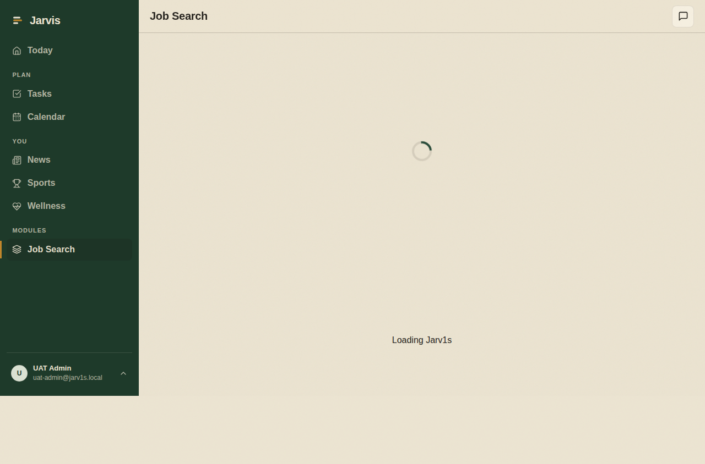
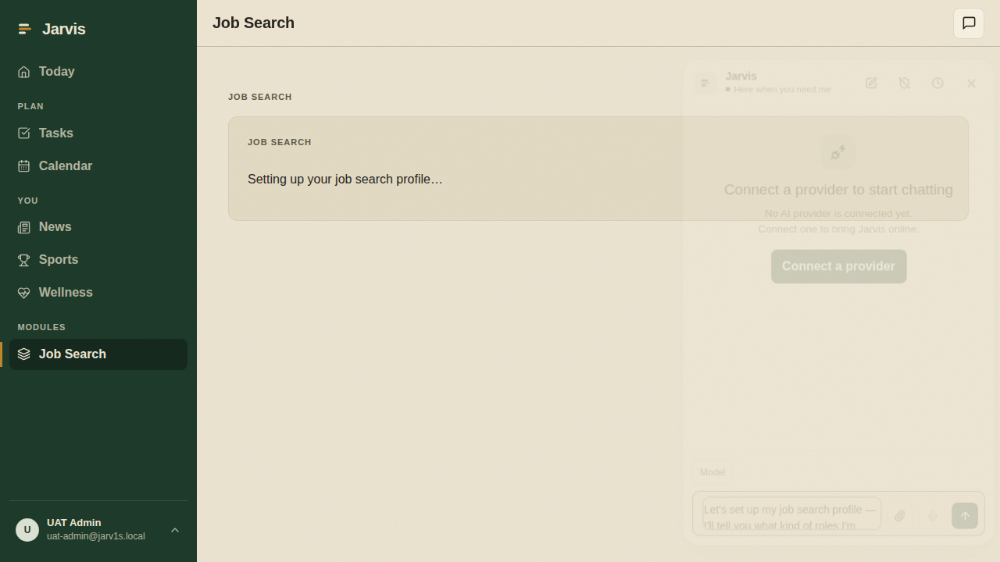
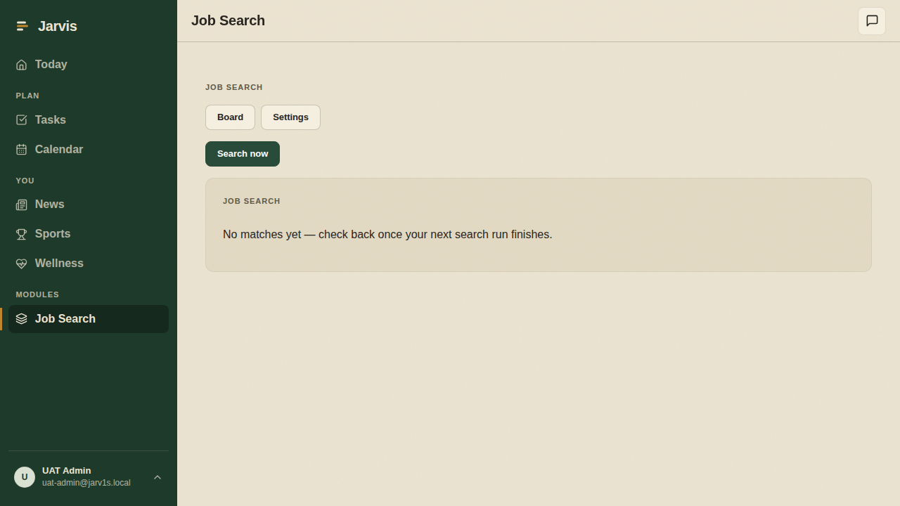
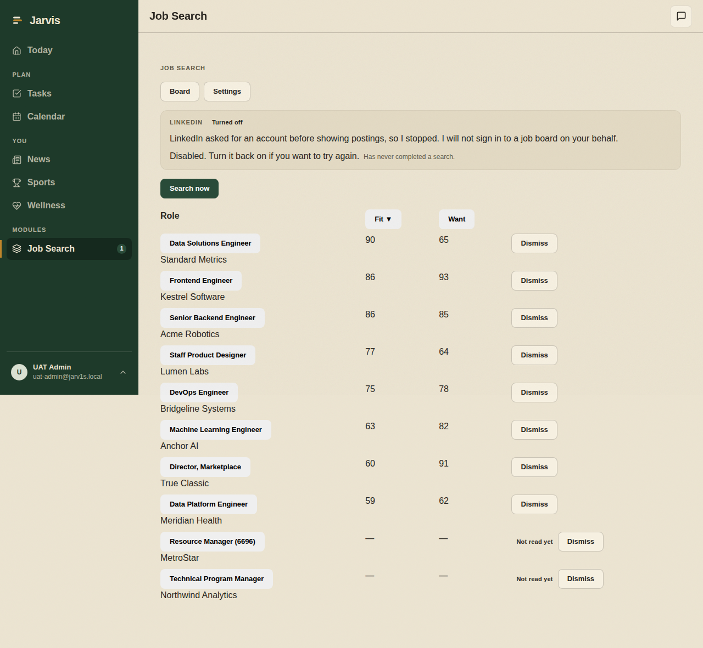
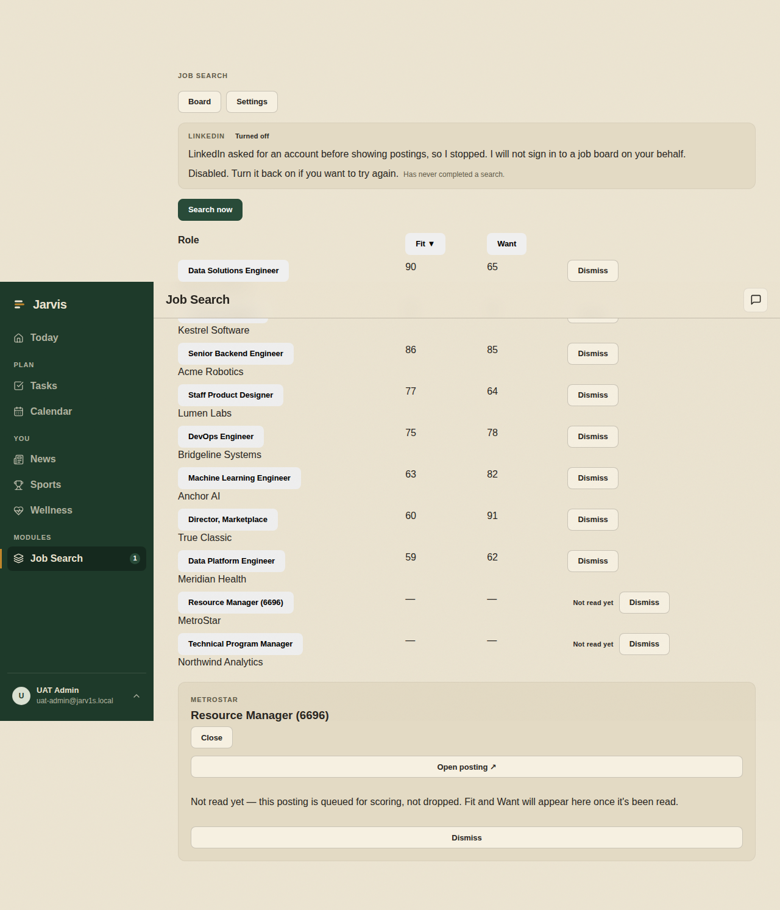
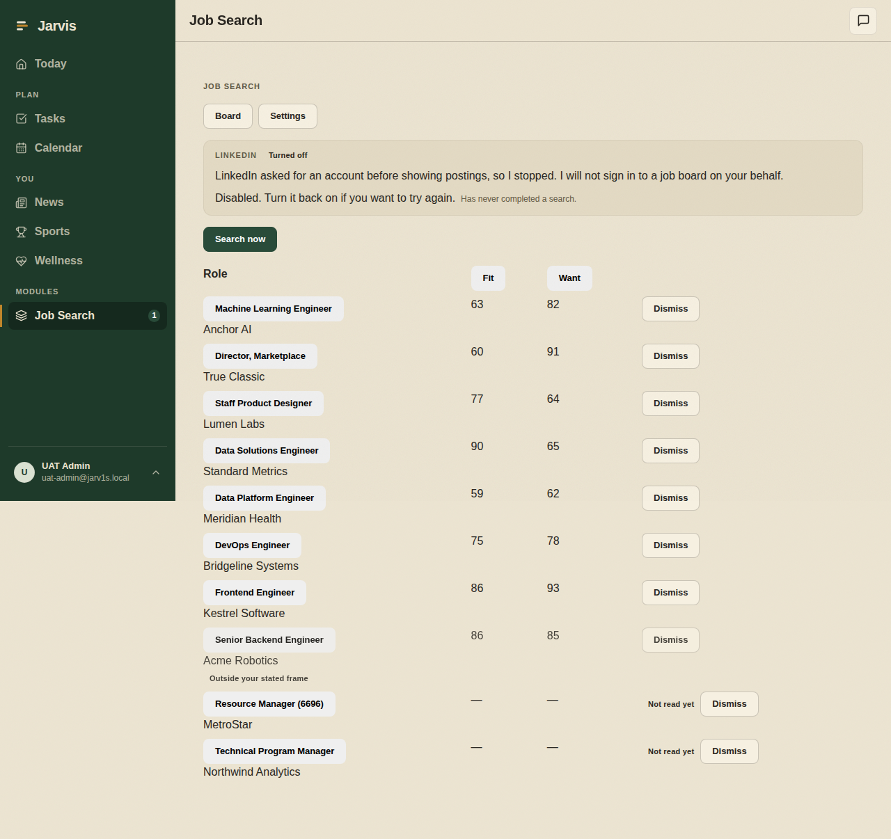
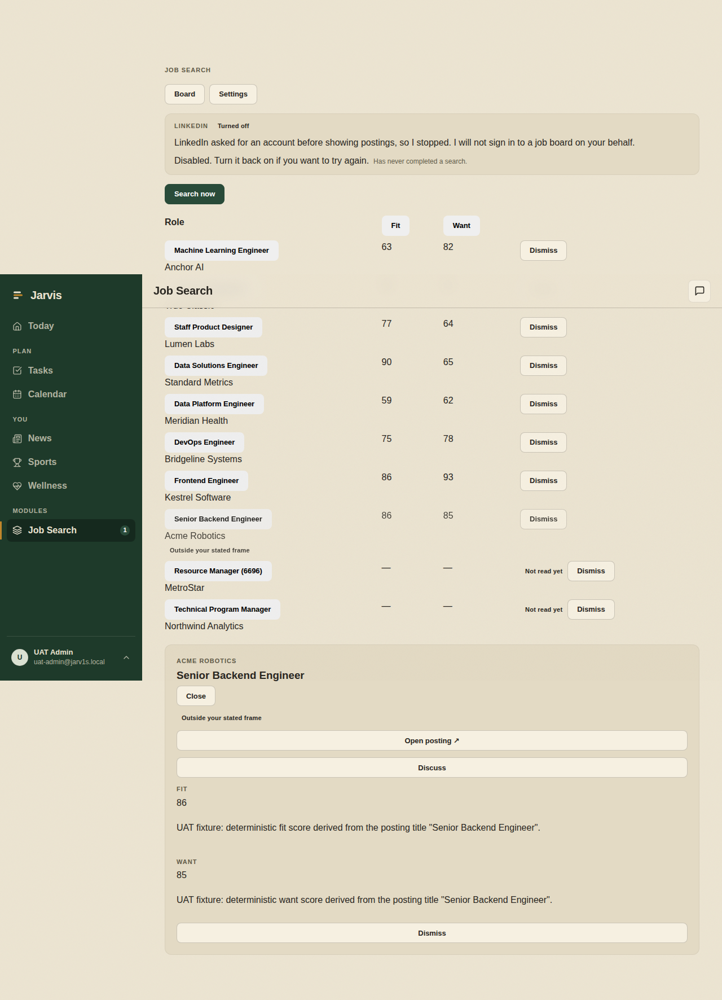
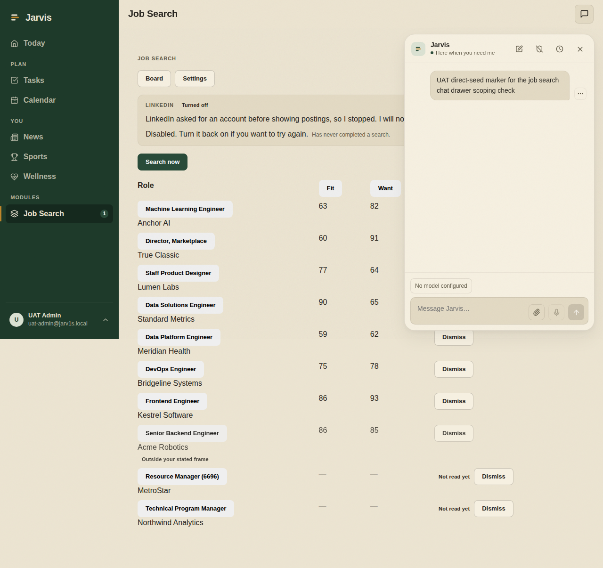
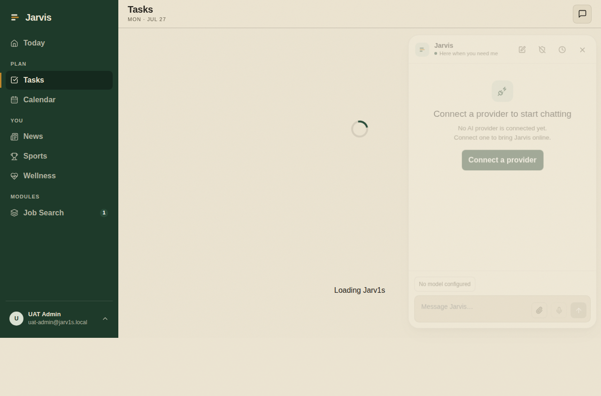

# Job Search — manual test walkthrough

A script you can follow end to end in about twenty minutes. Each step says what to do, what you
should see, and the one thing that would make it a fail. Screenshots in `screenshots/` show the
expected state for every step the automated UAT covers.

The screenshots come from the automated run (`tests/uat/specs/job-search-board.uat.spec.ts`), which
crawls a fixture standing in for the real job boards. On your dev instance the same screens are
filled with **real postings from freehire.me**, so the companies and role titles will differ — the
layout, columns, badges and banners are what to compare against.

Two other things about the screenshots specifically, so they don't send you chasing ghosts:

- The Fit/Want explanations in them read _"UAT fixture: deterministic fit score derived from the
  posting title…"_. That is the stand-in model talking. On your instance these are real sentences
  about the actual posting.
- They are full-page captures, so the fixed sidebar and header sometimes appear part-way down the
  image instead of pinned. That's the screenshot, not the app.

## Before you start

- **Instance:** the dev stack, not prod. Sign in as `ben@ben.com`.
- **A model must be configured.** Onboarding is a real conversation with Jarvis; without an active
  chat-capable model, step 3 stops at "No active chat-capable model is configured."
- **Expect to wait.** The crawl runs in the background. Postings appear on the board within a few
  seconds; the Fit/Want scores land a little later, one AI call per posting.

---

## 1. Install and enable the module

Instance → Modules → install **Job Search**, then enable it.

**You should see:** Job Search appears in the left nav with a compass icon.

| | |
|---|---|
| Pass | Nav entry present, opens without error |
| Fail | Module installs but the nav entry never appears |

---

## 2. "Start your job search" hands you a draft — it never sends

Open Job Search. On the empty state, press **Start your job search**.

**You should see:** the core Jarvis composer opens with a message already typed in it, **not sent**.
Nothing is sent on your behalf; you read it, edit it if you like, and press Enter yourself.

| | |
|---|---|
| Pass | Draft sits unsent in the composer, waiting for you |
| Fail | A message is sent automatically, or the composer is empty |

---

## 3. The onboarding conversation

Send the draft and talk to Jarvis normally. It runs a short interview covering five things, shown as
chips that fill in as you go:

| Chip | What it is asking |
|---|---|
| `role` | What you're looking for |
| `want` | What you actually want out of the next job |
| `where` | Location / remote |
| `comp` | Compensation |
| `sources` | Which job boards to search |

Answer in your own words — it is a conversation, not a form. You can give several answers in one
message.

**You should see:** each chip turn green as its topic is settled. Reload the page — the green chips
stay green. When all five are done the profile goes active on its own.

| | |
|---|---|
| Pass | All five chips complete, and survive a reload |
| Fail | A chip you clearly answered never completes, or completion resets on reload |

> No screenshot: the automated run skips this phase unless an operator supplies a real model token,
> because a canned model can't hold a real five-topic interview. **This step is the main reason to do
> the walkthrough by hand.**

---

## 4. The search starts by itself

As soon as the profile goes active, the crawl is queued automatically. You don't press anything.

**You should see:** the chat is replaced by the board, with **Board** and **Settings** tabs.

| | |
|---|---|
| Pass | Board appears without you asking for it |
| Fail | You have to trigger the search manually |

---

## 5. Matches, with Fit and Want kept apart

Give it a minute. Rows appear first, scores follow.

**You should see:** one row per posting, with **Fit** and **Want** as two separate columns.

- **Fit** — how well the posting matches the criteria you stated.
- **Want** — how well it matches what you actually said you want.

These are never averaged into one "82% match" number. That is deliberate: a role can be a perfect
fit and something you'd hate, and collapsing the two hides exactly the thing you need to see.

| | |
|---|---|
| Pass | Two distinct columns, both populated, no blended score anywhere |
| Fail | A single combined match percentage appears |

---

## 6. Sorting

Click the **Fit** column header, then **Want**.

**You should see:** rows reorder by that column, highest first. Rows not yet scored sort to the
bottom rather than being mixed in.

| | |
|---|---|
| Pass | Order changes, unscored rows stay at the bottom |
| Fail | Unscored rows interleave with scored ones |

---

## 7. LinkedIn stops rather than signing in

LinkedIn asks for an account before it shows postings.

**You should see:** a banner saying so in plain terms, along with what it means for you —

- LinkedIn asked for an account before showing postings, so it stopped.
- **It will not sign in to a job board on your behalf.** Not with your credentials, not ever.
- The source has been turned off.
- It has never completed a search.

This is the intended behaviour, not a bug: a login-walled or paywalled source is a hard stop.

| | |
|---|---|
| Pass | Banner explains the stop in plain language and names all four facts |
| Fail | Silent failure, a raw error code, or any attempt to sign in |

> The banner sits above the board, so it is visible in every board screenshot in this document —
> this frame is the same view, captured at the point the automated run checks the wording.

---

## 8. An unread posting says so honestly

Scoring costs an AI call per posting, so it runs to a budget. Postings past the budget are still
kept — they're queued, not thrown away.

Click a row showing **Not read yet**.

**You should see:** the Inspector open with "Not read yet — this posting is queued for scoring, not
dropped. Fit and Want will appear here once it's been read."

| | |
|---|---|
| Pass | Says queued, not dropped |
| Fail | Blank scores with no explanation, or the posting disappears |

---

## 9. "Outside your stated frame"

Some postings miss your stated criteria but match who you are — a role you didn't think to ask for.
Those are surfaced rather than filtered out, and labelled so you know why they're there.

**You should see:** an **Outside your stated frame** badge on the row, and again in the Inspector.

| | |
|---|---|
| Pass | Badge on both the row and the Inspector |
| Fail | Such postings are silently dropped, or appear unlabelled |

> On your dev instance this depends on what freehire.me actually returns — you may not get one. It
> isn't a fail if no posting qualifies.

---

## 10. The chat drawer follows you

Inside a job search profile, open the Jarvis chat drawer from the header.

**You should see:** the conversation for *that profile*.

Now navigate away to Tasks and open the drawer again.

**You should see:** your normal Jarvis chat. The job-search thread does not follow you out of the
module.

| | |
|---|---|
| Pass | Profile thread inside, absent outside |
| Fail | The drawer is empty inside the profile, or the module thread leaks onto other pages |

> The single message in the first frame is a marker the automated run plants to prove the drawer is
> reading the profile's own thread. Yours will hold the onboarding conversation from step 3.

---

## Beyond the automated run

These aren't covered by the UAT. Worth trying by hand.

### 11. Add your own job board

Tell Jarvis, in the profile's chat: *"add https://<some job board> as a source for this search."*

**You should see:** it registers the board and includes it in the next crawl. Permission to reach
that host is granted as part of adding it — you don't configure anything separately.

**Should fail safely:** point it at a board that requires a login. It should stop the same way
LinkedIn does, rather than asking you for credentials.

### 12. Dismiss a match

Dismiss a row you don't care about.

**You should see:** it leaves the board and stays gone after a reload.

### 13. Briefing detail

Settings tab → **Briefing detail**. This controls how much this search contributes to your daily
briefing.

**You should see:** the next morning/evening briefing mentions new matches at the level you chose —
the strongest ones, not everything found.

---

## If something goes wrong

Note the step number and what you saw instead. The most useful details are the exact on-screen
wording and whether a reload changes it — the board fetches once when it loads, so a reload is the
quickest way to tell a stale screen from a real problem.
